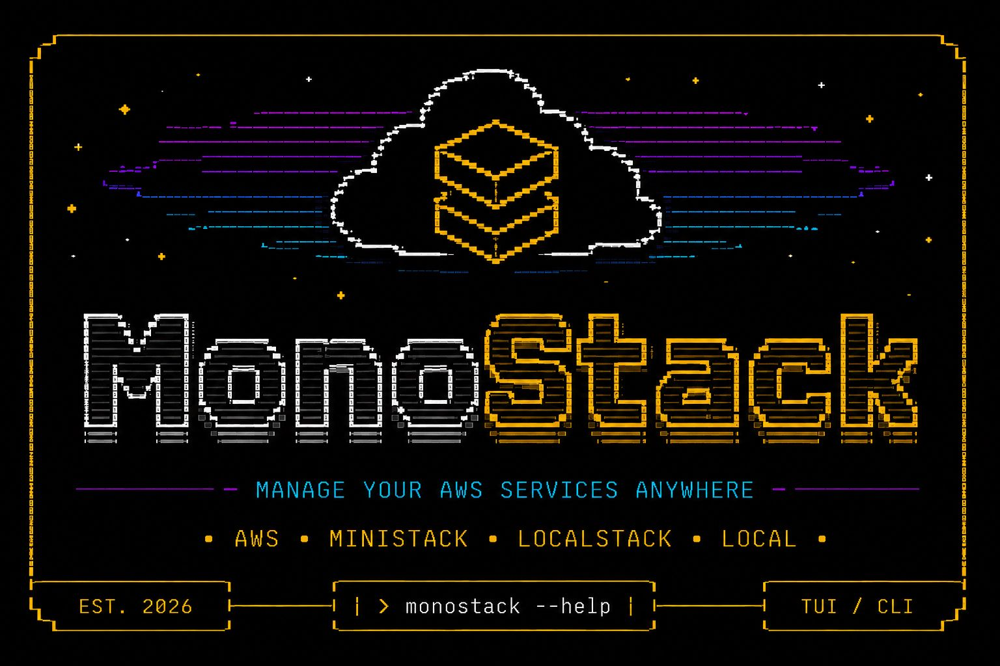

# monostack

<p align="center">
  <a href="https://github.com/JoaoOliveira889/monostack/releases/latest"></a>
  <a href="https://github.com/JoaoOliveira889/monostack/releases/latest"></a>
  <a href="https://goreportcard.com/report/github.com/JoaoOliveira889/monostack"></a>
  <a href="https://github.com/JoaoOliveira889/monostack"></a>
</p>

**Multi-service AWS dashboard for your terminal.** A TUI tool that connects to AWS (or LocalStack) and gives you a panoramic view of S3 buckets, SQS queues, SNS topics, and Secrets Manager — with one-key actions for common workflows and confirmation guards for every mutating command.

Current release: [0.0.5](https://github.com/JoaoOliveira889/monostack)



Built with [Bubble Tea](https://github.com/charmbracelet/bubbletea), [Lip Gloss](https://github.com/charmbracelet/lipgloss), and [Bubbles](https://github.com/charmbracelet/bubbles).

---

## Feature Cards

| S3 Explorer | SQS Queues | SNS Topics |
|---|---|---|
| Split-panel browsing for buckets and objects, with downloads, uploads, presigned URLs, and destructive actions behind confirmations. | Live queue counts with peek, send, purge, create, delete, and SNS route context. | Topic inspection, publishes, subscriptions, and YAML import for `SNS → SQS` routing. |
| Secrets Manager | Configuration Profiles | Snapshots & Logs |
|---|---|---|
| Secret metadata, version history, masked values, create/update/restore flows, and safe deletion. | Persistent profiles for endpoints, credentials, mock mode, enabled services, and panel preferences. | Snapshot export/import plus a command log for reviewing AWS actions and raw output. |

---

## Documentation

For detailed guides, configuration options, and troubleshooting, visit our **[Wiki Documentation](docs/README.md)**.

- [Getting Started](docs/getting-started.md)
- [Keybindings Reference](docs/keybindings.md)
- [Configuration Guide](docs/configuration.md)
- [Troubleshooting](docs/troubleshooting.md)

## Features

- **S3 Explorer**: Browse buckets and objects in a split-panel view. Download, delete, create buckets, upload objects, and open presigned URLs in your browser.
- **SQS Queues**: List queues with real-time message counts. Peek messages, send JSON payloads, purge queues, and manage SNS subscriptions targeting each queue.
- **SNS Topics**: List topics, inspect routes, publish messages, and manage subscriptions with filter policies. Import topic-scoped YAML subscription definitions for `SNS → SQS` routing.
- **Secrets Manager**: List, inspect, create, update, version, restore, and delete secrets with masked values until explicitly revealed.
- **Configuration Profiles**: Save and switch between AWS connection profiles — LocalStack/MiniStack endpoints, real AWS via SDK credential chain, or Mock Mode for offline testing.
- **Panel Layout Persistence**: Each service remembers its own split ratio, and new or re-enabled panels open at `50/50` until you resize them.
- **LocalStack Support**: Full support for local AWS simulation via configurable endpoints.
- **Tokyo Night Theme**: A beautiful, dark theme crafted with Lip Gloss for maximum readability.
- **Snapshot Export/Import**: Export your entire environment (queues, topics, subscriptions, secrets, S3 buckets) to a YAML snapshot and restore it later.
- **Command Log**: A dedicated panel to inspect a temporary in-memory history and raw output of every executed AWS command.
- **Safety First**: Configuration files stored with `0600` permissions, no hardcoded credentials, and all external calls have configurable timeouts.

---

## Installation

### Option 1 — Homebrew (macOS & Linux)

```bash
brew tap JoaoOliveira889/tap
brew install monostack
```

### Option 2 — Pre-built binary

Download the latest release for your platform from the [Releases page](https://github.com/JoaoOliveira889/monostack/releases/latest).

```bash
# macOS (Apple Silicon)
curl -LO https://github.com/JoaoOliveira889/monostack/releases/latest/download/monostack_Darwin_arm64.tar.gz
tar -xzf monostack_Darwin_arm64.tar.gz
sudo mv monostack /usr/local/bin/

# macOS (Intel)
curl -LO https://github.com/JoaoOliveira889/monostack/releases/latest/download/monostack_Darwin_x86_64.tar.gz
tar -xzf monostack_Darwin_x86_64.tar.gz
sudo mv monostack /usr/local/bin/

# Linux (amd64)
curl -LO https://github.com/JoaoOliveira889/monostack/releases/latest/download/monostack_Linux_x86_64.tar.gz
tar -xzf monostack_Linux_x86_64.tar.gz
sudo mv monostack /usr/local/bin/
```

### Option 3 — Install with `go install`

```bash
go install github.com/JoaoOliveira889/monostack/cmd/monostack@latest
```

> Requires Go 1.26.3 or later.

### Option 4 — Build locally and keep it on your PATH

```bash
git clone https://github.com/JoaoOliveira889/monostack.git
cd monostack
make install-local
```

This builds the current checkout into `~/bin/monostack`. Add `export PATH="$HOME/bin:$PATH"` once if needed, then rerun `make install-local` whenever you pull updates.

---

## Usage

```bash
# Launch the dashboard
monostack
```

### Flags

| Flag         | Default | Description               |
|--------------|---------|---------------------------|
| `--version`  | `false` | Show version information  |

---

## Keybindings

### Global

| Key | Action |
|-----|--------|
| `1` | S3 Explorer tab |
| `2` | SQS Queues tab |
| `3` | SNS Topics tab |
| `4` | Secrets Manager tab |
| `5` | Settings tab |
| `↑ | k` | Move cursor up |
| `↓ | j` | Move cursor down |
| `← | h` | Navigate back / Switch panel |
| `→ | l` | Navigate forward / Switch panel |
| `< | >` | Resize split panels |
| `tab` | Cycle between panels |
| `ctrl+p | ?` | Toggle Help Menu |
| `o` | Command logs |
| `space` | Start or extend text selection |
| `y` | Copy selected text |
| `esc` | Back / Cancel / Close |
| `q` | Quit |

### S3 Explorer

| Key | Action |
|-----|--------|
| `Enter` / `→` | Select bucket / enter object view |
| `Esc` / `←` | Back to bucket list |
| `b` | Open file in browser (presigned URL) |
| `u` | Upload object |
| `v` | Preview object |
| `w` | Download file |
| `d` | Delete file or bucket |
| `c` | Create bucket |
| `f` | Create folder prefix |

### SQS Queues

| Key | Action |
|-----|--------|
| `Enter` | Inspect selected queue |
| `→` / `l` | Open queue routes |
| `v` | Peek messages |
| `s` | Send message |
| `p` | Purge queue |
| `P` | Purge all loaded queues |
| `b` | Subscribe topics |
| `c` | Create queue |
| `d` | Delete queue |

### SNS Topics

| Key | Action |
|-----|--------|
| `Enter` | Inspect selected topic or route |
| `→` / `l` | Open subscriptions |
| `s` | Publish event |
| `i` | Import subscription YAML |
| `c` | Create topic |
| `b` | Batch subscribe |
| `e` | Edit filter |
| `d` | Delete topic |

### Secrets Manager

| Key | Action |
|-----|--------|
| `Enter` | Inspect selected secret |
| `l` / `h` | Switch list or versions |
| `r` | Promote selected version |
| `c` | Create secret |
| `u` | Update secret value |
| `v` | Reveal selected secret value |
| `R` | Restore secret |
| `d` | Delete secret |

### Settings

| Key | Action |
|-----|--------|
| `Enter` | Edit selected field |
| `Esc` | Stop editing |
| `Tab` | Next field |
| `Shift+Tab` | Previous field |
| `s` | Save profile |

The Settings panel also includes an `Enabled Services` field. Set it to a comma-separated list like `s3,sqs,sns,secrets` to hide unused panels and stop reloading them. Each service panel keeps its own split ratio, and new or re-enabled panels open at `50/50` until the user resizes them.

Mutating actions prompt for confirmation before they run.

---

## YAML Subscriptions

MonoStack stores subscription YAML per SNS topic. Each topic gets its own file, and the editor opens in the context of the selected topic:

```yaml
version: 1

subscriptions:
  - name: account
    topic: dev-webapi-accounts-sns
    event_type:
      - account_actived
      - account_created_event
```

`queue` is optional per entry. MonoStack uses `queue` first, then `default_queue`, then a sibling queue inferred from the topic name (`-sns` → `-sqs`). `default_filter_scope` is also optional and falls back to `message_body` when omitted.

---

## Architecture

The project follows **Clean Architecture** principles, keeping business logic decoupled from implementation details:

```
monostack/
├── cmd/monostack/      # Entry point
├── internal/
│   ├── domain/         # Core entities: S3, SQS, SNS, Secrets, Config interfaces
│   ├── usecase/        # Business logic: AWS operations orchestrator
│   ├── adapters/
│   │   ├── aws/        # AWS SDK v2 providers (S3, SQS, SNS, Secrets Manager)
│   │   └── tui/        # Bubble Tea UI: model, update, view, keys
│   ├── pkg/
│   │   ├── config/     # File-based config and subscription storage
│   │   └── ui/         # Shared styles (Tokyo Night palette)
└── .goreleaser.yaml    # Multi-platform release config
```

**Security note:** Configuration files are stored with `0600` permissions, no hardcoded credentials in source code, AWS credentials follow the standard SDK credential chain, and all external calls have timeouts (8-15s).

---

## Contributing

Contributions are welcome! Please read [CONTRIBUTING.md](CONTRIBUTING.md) before opening a pull request.

1. Fork the repository
2. Create a feature branch: `git checkout -b feat/my-feature`
3. Commit your changes following [Conventional Commits](https://www.conventionalcommits.org/)
4. Push and open a Pull Request

---

## Support

If monostack helps you manage AWS services more efficiently, consider supporting its development.

<a href="https://www.buymeacoffee.com/JoaoOliveira889" target="_blank"></a>

---

## License

[MIT](LICENSE) © João Oliveira
